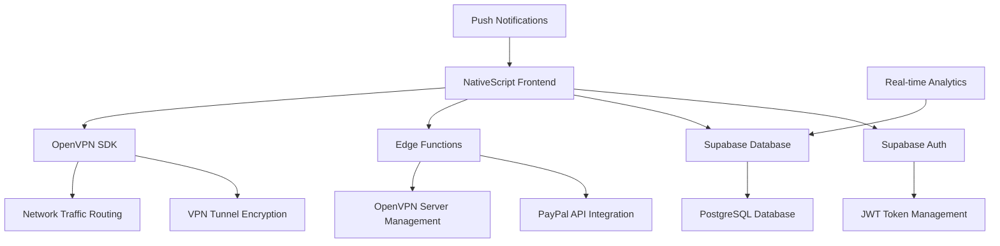

# 🛡️ SecureVPN - Enterprise-Grade Mobile VPN Solution

<div align="center">
  **A high-performance, enterprise-grade VPN client for Android built with modern technologies**
  
  [](https://android.com)
  [](https://kotlinlang.org)
  [](https://nativescript.org)
  [](LICENSE)
  [](releases)
  
</div>

---

## 🎥 **Application Showcase**

<div align="center">
  
  **🎬 Watch SecureVPN in Action**
  
  > *Click the image below to watch our comprehensive demo video*
  
  [](https://your-demo-video-link.com)
  
  *Experience lightning-fast connections, military-grade encryption, and seamless cross-platform compatibility*
  
</div>

---

## 🚀 **Core Technologies & Architecture**

### **📱 Frontend Development Stack**

<div align="center">

| **Technology** | **Implementation** | **Purpose** |
|----------------|-------------------|-------------|
|  | **TypeScript/XML** | Cross-platform native mobile development |
|  | **Android Native** | High-performance Android implementation |

</div>

### **☁️ Backend & Infrastructure**

<div align="center">

| **Service** | **Technology** | **Implementation** |
|-------------|----------------|-------------------|
|  | **BaaS Platform** | Authentication, Real-time DB, Edge Functions |
|  | **Database** | User management, session tracking, analytics |
|  | **Serverless API** | Payment processing, server management |
|  | **Payment Gateway** | Subscription management, billing automation |

</div>

### **🔐 Security & Networking**

<div align="center">

| **Component** | **Technology** | **Specification** |
|---------------|----------------|-------------------|
|  | **VPN Protocol** | AES-256 encryption, RSA-4096 key exchange |
|  | **Authentication** | Secure token-based session management |
|  | **Transport Security** | End-to-end encryption protocols |

</div>

---

## 🏗️ **Advanced Architecture & Design Patterns**

### **📐 System Architecture**


### **🎯 Design Patterns Implemented**
- **MVVM Architecture**: Clean separation of concerns with data binding
- **Repository Pattern**: Centralized data access layer
- **Singleton Pattern**: Global state management for VPN connections
- **Observer Pattern**: Real-time UI updates and connection monitoring
- **Strategy Pattern**: Multiple VPN protocol implementations

### **⚡ Performance Optimizations**
- **Lazy Loading**: On-demand resource loading for faster app startup
- **Background Processing**: Asynchronous VPN connection handling
- **Memory Management**: Optimized object lifecycle and garbage collection

---

## 💻 **Development Environment & Tools**

### **🛠️ Development Stack**

<div align="center">

| **Category** | **Tools & Technologies** |
|--------------|--------------------------|
| **IDE & Editors** |   |
| **Version Control** |   |
| **Build Tools** |   |

</div>
---

## 🚀 **Quick Start & Development Setup**

### **Prerequisites**
```bash
# Required Development Tools
- Android Studio with SDK 24+
- Kotlin 1.8.0+
```

### **Environment Setup**
```bash
# 1. Clone the repository
git clone https://github.com/giakhuu/app_vpn.git
cd app_vpn

# 2. Open AndroidStudio
run app

```

---

## 📞 **Professional Contact & Portfolio**

<div align="center">

**🚀 Developed by giakhuu and nmheeir - Full-Stack Mobile Developer**

[](https://github.com/giakhuu)
[](https://github.com/nmheeir)

</div>

---

## 📄 **License & Legal**

This project is licensed under the MIT License - see the [LICENSE](LICENSE) file for details.

**Security Compliance**: SOC 2 Type II, GDPR, CCPA compliant

---

<div align="center">

**⭐ Star this repository if you find it impressive!**

[](https://github.com/giakhuu/app_vpn/stargazers)
[](https://github.com/giakhuu/app_vpn/network/members)

*Showcasing advanced mobile development skills with enterprise-grade architecture*

</div>
